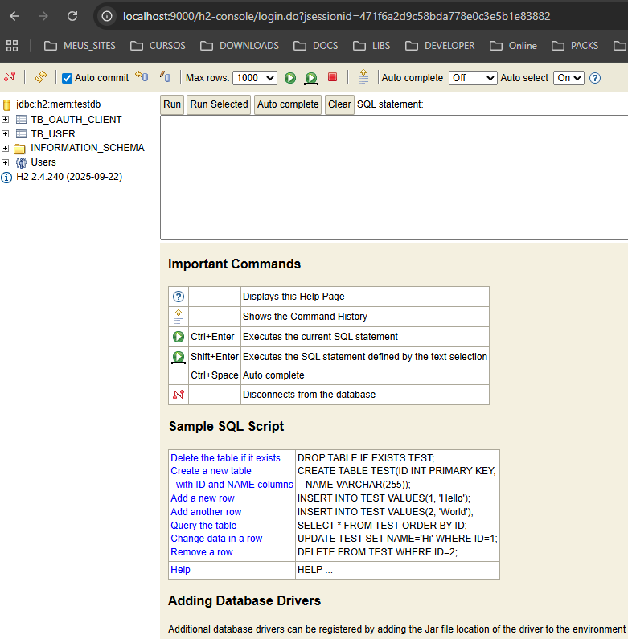
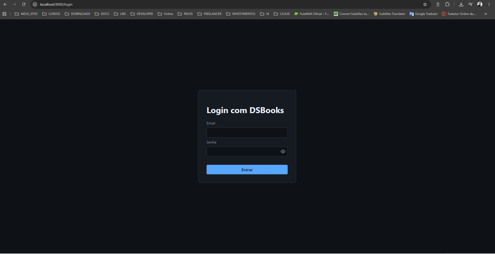
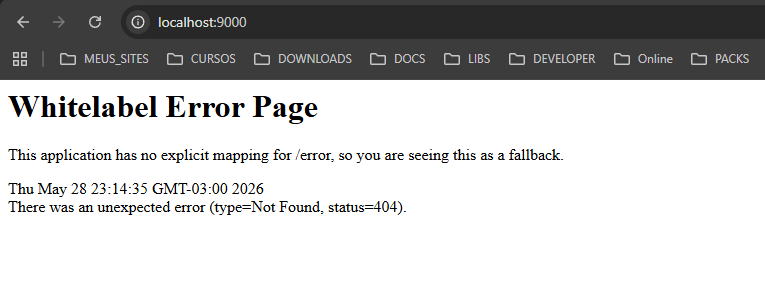

# 📚 dsbooks-as

> 🎯 Servidor de autenticação (Authorization Server) usado no projeto DSBooks — implementado com Spring Boot e OAuth2.


## ✨ Visão geral

Este repositório contém um Authorization Server desenvolvido em Java com Spring Boot, responsável por gerenciar autenticação e autorização (clientes OAuth2, tokens, fluxos de login). O projeto fornece endpoints para login via formulário, configuração de clientes OAuth (importável via SQL), e integração com aplicações clientes que consomem tokens JWT/OAuth2.

O código está organizado como uma aplicação Spring Boot tradicional e inclui modelos de entidade, repositórios, serviços e controladores para o fluxo de autenticação.


## 🧭 Recursos principais

- Gerenciamento de clientes OAuth2 (import via `import_clients.sql`).
- Login via formulário Thymeleaf (páginas em `src/main/resources/templates`).
- Integração com Spring Security e suporte a fluxos OAuth2 compatíveis com aplicações clientes.
- Estrutura pronta para testes automatizados (pasta `src/test`).


## 🛠️ Tecnologias utilizadas

| Ícone | Tecnologia | Observações |
|---|---|---|
| ☕ | Java | Linguagem base do projeto |
| 🌀 | Spring Boot | Framework principal |
| 🔐 | Spring Security / OAuth2 | Autenticação e autorização |
| 📦 | Maven | Gerenciamento de dependências e build |
| 🧾 | Thymeleaf | Templates para páginas HTML (login) |
| 🧪 | JUnit | Testes automatizados |
| 🗄️ | H2 / JDBC / SQL | Scripts de import (ex: `import_clients.sql`) |


## 📋 Pré-requisitos

- Java 25
- Maven (ou usar o wrapper incluído)
- Git
- IDE (IntelliJ IDEA, Eclipse, VS Code) — recomendado


## 🔧 Dependências (como executar localmente)

As dependências estão gerenciadas via Maven no `pom.xml`. Você pode usar o wrapper incluído para evitar instalar Maven globalmente.


## 🚀 Como clonar, compilar e rodar (Windows PowerShell)

1. Clone o repositório:

```powershell
git clone https://github.com/marcionavarro/devsuperior.git
cd dsbooks-as
```

2. Rodar a aplicação usando o Maven Wrapper (Windows):

```powershell
# Build
.\mvnw.cmd clean package -DskipTests

# Rodar
.\mvnw.cmd spring-boot:run
```

Ou usando Maven instalado globalmente:

```powershell
mvn clean package -DskipTests
mvn spring-boot:run
```

A aplicação por padrão sobe na porta 8080 (http://localhost:8080). Ajuste as propriedades em `src/main/resources/application.properties` caso necessário.


## ✅ Testes

Para executar os testes:

```powershell
.\mvnw.cmd test
```


## 🎮 Guia de uso

1. Acesse a tela de login: http://localhost:9000/login (ou a rota definida no projeto).
2. Use um usuário já cadastrado na base (ou configure uma `DataBaseSeeder` / script para criar usuários de teste).
3. Aplicações clientes configuradas (por exemplo via `import_clients.sql`) podem requisitar tokens com os secrets/clients cadastrados.

Dicas:
- Verifique `src/main/resources/import_clients.sql` para exemplos de clientes registráveis.
- Para depuração, ative logs do Spring Security no `application.properties`.


## 🖼️ Screenshots






## 📁 Estrutura do projeto (explicada)

Raiz do projeto — principais pastas:

- `src/main/java/com/marcionavarro/authserver/` - código fonte Java
  - `config/` - classes de configuração Spring (ex: AuthorizationServerConfig)
  - `controllers/` - endpoints e controladores (ex: `LoginController`)
  - `entities/` - entidades JPA (ex: `UserEntity`, `OAuthClient`)
  - `repositories/` - repositórios Spring Data
  - `services/` - regras de negócio
- `src/main/resources/` - recursos
  - `application.properties` - configurações da aplicação
  - `import_clients.sql` - script para importar clientes OAuth
  - `templates/` - páginas Thymeleaf (ex: `login.html`)
  - `static/` - arquivos estáticos (CSS/JS)
- `src/test/` - testes automatizados
- `pom.xml` - arquivo de build Maven
- `mvnw`, `mvnw.cmd` - Maven Wrapper

## 📚 Recursos e links úteis

- Spring Boot: https://spring.io/projects/spring-boot
- Spring Security / OAuth2: https://spring.io/projects/spring-security
- Thymeleaf: https://www.thymeleaf.org/
- Maven: https://maven.apache.org/
- Guia OAuth2 (Spring): https://spring.io/guides